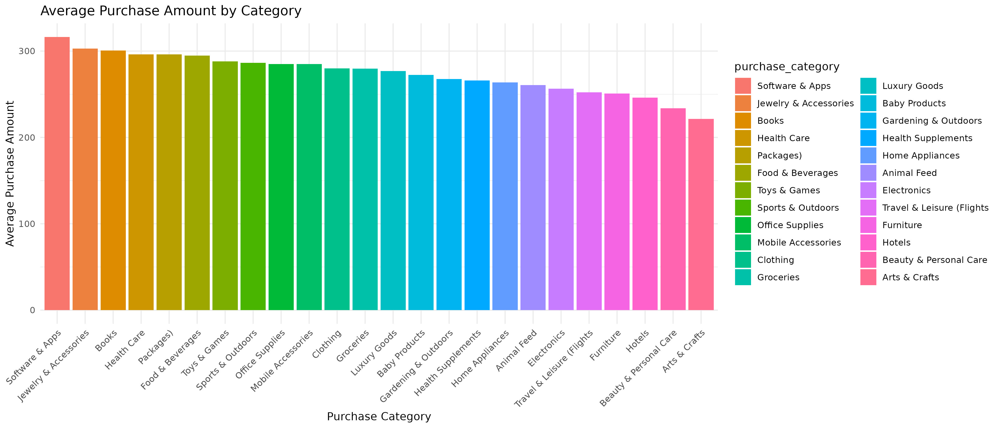

# Ecommerce Consumer Behavior Analysis Data

## Install package
```r
install.packages('tidyverse')
install.packages('dplyr')
library(readr)
library(dplyr)

# read file
df <- read_csv('Ecommerce_Consumer_Behavior_Analysis_Data.csv')

# data str
str(df)
```
First of all, we need to upload the file to our work directory before using `read_csv()` and don't forget to assign a variable. 
Then I checked the data structure, there're 1,000 row and columns. The columns are following:

1. **Customer_ID**: Unique identifier for each customer.
2. **Age**: Customer's age (integer).
3. **Gender**: Customer's gender (categorical: Male, Female, Non-binary, Other).
4. **Income_Level**: Customer's income level (categorical: Low, Middle, High).
5. **Marital_Status**: Customer's marital status (categorical: Single, Married, Divorced, Widowed).
6. **Education_Level**: Highest level of education completed (categorical: High School, Bachelor's, Master's, Doctorate).
7. **Occupation**: Customer's occupation (categorical: Various job titles).
8. **Location**: Customer's location (city, region, or country).
9. **Purchase_Category**: Category of purchased products (e.g., Electronics, Clothing, Groceries).
10. **Purchase_Amount**: Amount spent during the purchase (decimal).
11. **Frequency_of_Purchase**: Number of purchases made per month (integer).
12. **Purchase_Channel**: The purchase method (categorical: Online, In-Store, Mixed).
13. **Brand_Loyalty**: Loyalty to brands (1-5 scale).
14. **Product_Rating**: Rating given by the customer to a purchased product (1-5 scale).
15. **Time_Spent_on_Product_Research**: Time spent researching a product (integer, hours or minutes).
16. **Social_Media_Influence**: Influence of social media on purchasing decision (categorical: High, Medium, Low, None).
17. **Discount_Sensitivity**: Sensitivity to discounts (categorical: Very Sensitive, Somewhat Sensitive, Not Sensitive).
18. **Return_Rate**: Percentage of products returned (decimal).
19. **Customer_Satisfaction**: Overall satisfaction with the purchase (1-10 scale).
20. **Engagement_with_Ads**: Engagement level with advertisements (categorical: High, Medium, Low, None).
21. **Device_Used_for_Shopping**: Device used for shopping (categorical: Smartphone, Desktop, Tablet).
22. **Payment_Method**: Method of payment used for the purchase (categorical: Credit Card, Debit Card, PayPal, Cash, Other).
23. **Time_of_Purchase**: Timestamp of when the purchase was made (date/time).
24. **Discount_Used**: Whether the customer used a discount (Boolean: True/False).
25. **Customer_Loyalty_Program_Member**: Whether the customer is part of a loyalty program (Boolean: True/False).
26. **Purchase_Intent**: The intent behind the purchase (categorical: Impulsive, Planned, Need-based, Wants-based).
27. **Shipping_Preference**: Shipping preference (categorical: Standard, Express, No Preference).
28. **Payment_Frequency**: Frequency of payment (categorical: One-time, Subscription, Installments).
29. **Time_to_Decision**: Time taken from consideration to actual purchase (in days).
    
```r
# check missing value
sum(is.na(df))

# data transformation 
# change colnames
colnames(df) <- tolower(colnames(df))
```
I checked if there're missing values in any columns. The result of `sum()` is 0, which means there're no missing value in this dataset.
Before diving into the insight, I changed the columns name into lowercase for readability. 

Now we're ready to go to the question part

## Key Question
**1. How does customer spending vary across different income level segments,
   and is there a statistically significant relationship between income level and the discount used?**
   ```r
   library(stringr)
   
   # remove $
   df$purchase_amount <- df$purchase_amount %>%
    str_remove_all("\\$") %>%
    str_trim() %>%
    as.numeric
   ```
The datatype of `purchase_amount` column in the original .csv data is text and contain `$`, which cannot be used for calculation.
So I removed the `$` and all possible white space by using function in `library(stringr)`, and coverted datatype from `chr` into `num`.
```r
# purchase mean by income level
avg_purchase <- df %>%
  select(income_level, purchase_amount) %>%
  group_by(income_level) %>%
  summarise(avg_purchase = mean(purchase_amount))
```
The first part of question asking about the purchase amount between 2 groups, high and middle income.
The result of 2 groups are quite similar, the average purchase amount of high income group is $276, while the middle group's is $275.

The second part is asking about discount used between those 2 groups.
```r
# create crosstab
crosstab <- table(df$income_level, df$discount_used)

# chisq test
chisq_result <- chisq.test(crosstab)
```
To determine if income levels are associated with the use of discounts, we will perform a chi-square test. But in case of using `chisq.test()`,
we need to create crosstab first to find the observed frequency. The crosstab results show that, 
among the high income group, 255 people use discounts while 260 do not. Among the middle income group, 266 people use discounts while 219 do not.

We set the assumptions:
- H0 = There is NO significant association between the two variables.
- H1 = there is significant association between the two variables.
  
According to the chi-square test, the p-value is 0.1046 (> 0.5), which means there'is no statistically significant difference between two groups -- so we fail to reject H0.

Based on the statistical results from our current data, a universal discount strategy appears effective, 
as there's no statistically significant need to tailor discounts to specific income levels.

**2. What is the average purchase amount for each product category, and which categories demonstrate the highest and lowest average transaction values?**
```r
library(ggplot2)
library(forcats)

# find average amount for each product category
avg_purchase_cate <- df %>%
  mutate(purchase_category = as.factor(purchase_category)) %>%
  select(purchase_category, purchase_amount) %>%
  group_by(purchase_category) %>%
  summarise(avg_purchase_cate = mean(purchase_amount)) %>%
  mutate(purchase_category = fct_reorder(purchase_category, avg_purchase_cate, .desc=TRUE)) %>%
  arrange(desc(avg_purchase_cate)) 

# create chart
ggplot(data = avg_purchase_cate,
       aes(x = purchase_category, 
           y = avg_purchase_cate, 
           fill = purchase_category)) +
geom_bar(stat = "identity") +
labs(title = "Average Purchase Amount by Category",
       x = "Purchase Category",
       y = "Average Purchase Amount") +
theme_minimal() +
theme(axis.text.x = element_text(angle = 45, hjust = 1))
```
I installed `ggplot2` for visualization with `ggplot`, and `forcats` to reorder charts by their height using `fct_reorder`.
After calculating the average purchase amount for each product category, I generated a bar chart to facilitate easier comprehension.



